Introduction
------------

This is an Rmarkdown document for extracting and analysis of tweets related to artificial intelligence.

``` r
library(tidyverse)
```

    ## -- Attaching packages -------------------------------------------------------------- tidyverse 1.2.1 --

    ## v ggplot2 2.2.1     v purrr   0.2.4
    ## v tibble  1.4.2     v dplyr   0.7.4
    ## v tidyr   0.8.0     v stringr 1.3.0
    ## v readr   1.1.1     v forcats 0.3.0

    ## -- Conflicts ----------------------------------------------------------------- tidyverse_conflicts() --
    ## x dplyr::filter() masks stats::filter()
    ## x dplyr::lag()    masks stats::lag()

``` r
library(rtweet)
library(qdapRegex)
```

    ## 
    ## Attaching package: 'qdapRegex'

    ## The following object is masked from 'package:dplyr':
    ## 
    ##     explain

    ## The following object is masked from 'package:ggplot2':
    ## 
    ##     %+%

``` r
library(tidytext)
```

Collection of free Twitter data for 7-day period using the `rtweet` package.

AItwtdata &lt;- search\_tweets(q="artificial intelligence OR AI OR Artificial Intelligence", n = 12000, retryonratelimit = TRUE, type = "mixed")

Saving data for use later.

``` r
#saveRDS(AItwtdata, "AItwtdata.Rds")
AItwtdata <-readRDS("AItwtdata.RDS")
```

Data preparation and exploration
--------------------------------

Filtering for tweets only in English.

``` r
AItwtdata <-AItwtdata %>% filter(lang == 'en')
```

The data is comprised of 11,276 English tweets and 42 variables. The tweet content text variable is the area of focus for sentiment analysis. This is a sample of text.

``` r
head(AItwtdata$text, 10)
```

    ##  [1] "supercomputing  artificialintelligence  skills  our new digital europe programme will shape europe's digital transformation to the benefit of citizens and businesses  today  we will present our  eubudget proposals on digital europe  outline explained  "                  
    ##  [2] "our artificialintelligence polling firm  polly  says 35  of voters are talking about the  renataford controversy  with 74  feeling more negative about  fordnation because of it  21  are defending ford and 5  neutral  no idea about fx on seat count   onpoli  election2018"
    ##  [3] "ok  here's a question for  narendramodi how do you promote excellence in india including in artificialintelligence etc while depressing the standards dramatically for half the population in college and in govt jobs  seems you're setting india up for a huge fall"         
    ##  [4] "our 2018 cgg essay prize is out   chance to win  100 amazon vouchers  up to 2 500 words on the topic  will artificialintelligence eventually replace cancer geneticists   details at   clingensoc  britsocgenmed  bmastudents  theagnc  acgs news"                             
    ##  [5] "rt  peopledoc inc   rpa doesn't mean hr will be replaced with robots  instead   hr will take  a hybrid approach  mixing processes with peop "                                                                                                                                  
    ##  [6] "rt  wired  apple hopes to inspire a new generation of ideas from developers by making it easier for them to incorporate machinelearning in "                                                                                                                                   
    ##  [7] "ai is driving the evolution of interconnected digital supply networks  this change can help supply chain managers be more dynamic  flexible  and efficient in their planning and execution "                                                                                   
    ##  [8] "rt  deepaerodrones  artificialintelligence chipmaker hailo raises  12 5 million  see more    ai  blockch "                                                                                                                                                                     
    ##  [9] "rt  civichall   opportunity   mozilla wants to help you help internet users understand ai  media makers and  technologists  apply now for a "                                                                                                                                  
    ## [10] "webinar  how artificialintelligence is transforming insurance  june 22  2018  ai  ml  dl"

Removing URLs from the text and add the selection criteria words.

``` r
AItwtdata$text <- rm_twitter_url(AItwtdata$text)

custom1_stop_words <- bind_rows(data_frame(word = c("artificialintelligence", "ai"), 
lexicon = c("custom")), stop_words)
```

### Initial tokenization and word count

``` r
tidyAItwt0 <- AItwtdata %>%
select(text) %>%
mutate(line = row_number()) %>%
unnest_tokens(word, text) %>%
anti_join(custom1_stop_words)
```

    ## Joining, by = "word"

Looking at word counts:

``` r
tidyAItwt0 %>% count(word, sort = TRUE)
```

    ## # A tibble: 11,372 x 2
    ##    word                n
    ##    <chr>           <int>
    ##  1 rt               6602
    ##  2 machinelearning  1375
    ##  3 gt                755
    ##  4 bigdata           752
    ##  5 future            685
    ##  6 read              653
    ##  7 business          652
    ##  8 amp               594
    ##  9 3                 506
    ## 10 artificial        479
    ## # ... with 11,362 more rows

Visualizing all words except for criteria selection words and the 6602 "rt," an artifact of Twitter, indicating retweet.

``` r
 tidyAItwt0 %>% 
  count(word, sort=TRUE) %>%
  filter(substr(word, 1, 1) != '#', # omit hashtags
         substr(word, 1, 1) != '@', # omit Twitter handles
         n > 400, n < 2500) %>% # only most common words
  mutate(word = reorder(word, n)) %>%
  ggplot(aes(word, n, fill = word)) +
  geom_bar(stat = 'identity') +
  xlab(NULL) +
  ylab("Word Count") +
  ggtitle('Most common words in tweets') +
  theme(legend.position="none") +
  coord_flip()
```

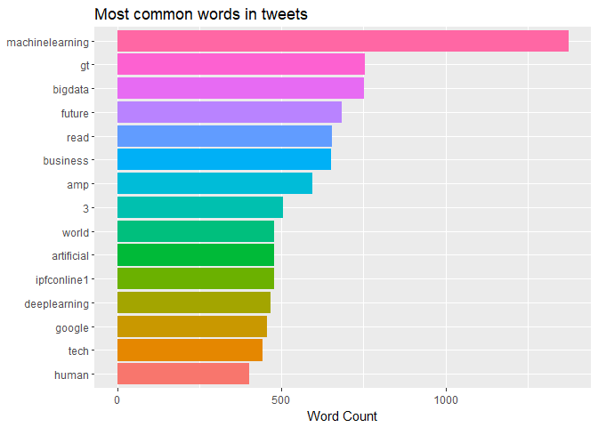

The word count reveals some non-English characters (converted they look like this <U+___>) and some word pairs that are technical jargon, which would not add anything to the sentiment analysis. However, the words of the jargon word-pairs occurring singly may contribute to the sentiment analysis. For example, "learning" may contribute positively, but "deep learning" should not be included. In order to render the most sentiment from these small messages, further cleaning of the data needs to occur preserving the unpaired words.

Removing the remaining non-English characters using `qdapRegex`.

``` r
AItwtdata$text <- gsub("[^0-9A-Za-z///']"," ", AItwtdata$text)
```

Preserving single words by joining word pairs

``` r
AItwtdata$text <- tolower(AItwtdata$text)
AItwtdata$text <- gsub(pattern = "artificial intelligence", "artificialintelligence", AItwtdata$text)
AItwtdata$text <- gsub(pattern = "deep learning", "deeplearning", AItwtdata$text)
AItwtdata$text <- gsub(pattern = "machine learning", "machinelearning", AItwtdata$text)
AItwtdata$text <- gsub(pattern = "big data", "bigdata", AItwtdata$text)
AItwtdata$text <- gsub(pattern = "data science", "datascience", AItwtdata$text)
```

Adding words to second custom stop word list

``` r
custom2_stop_words <- bind_rows(data_frame(word = c("artificialintelligence", "ai", "rt", "gt", "amp", "machinelearning","ml", "deeplearning","bigdata", "datascience", "3", "000", "1", "5", "10", "12", "2018", "2", "tech", "dl","iot", "software", "cybersecurity", "hr"), lexicon = c("custom")), stop_words)
```

Using added custom stop words and checking a word cloud for other words which do not belong in sentiment analysis.

``` r
tidyAItwt0 <- AItwtdata %>%
  select(text) %>%
  mutate(line = row_number()) %>%
  unnest_tokens(word, text) %>%
  anti_join(custom2_stop_words)
```

    ## Joining, by = "word"

``` r
tidyAItwt0 %>% count(word, sort = TRUE)
```

    ## # A tibble: 11,350 x 2
    ##    word            n
    ##    <chr>       <int>
    ##  1 future        685
    ##  2 read          653
    ##  3 business      652
    ##  4 world         479
    ##  5 ipfconline1   477
    ##  6 google        457
    ##  7 human         403
    ##  8 technology    390
    ##  9 data          382
    ## 10 fintech       370
    ## # ... with 11,340 more rows

Making a word cloud.

``` r
library(wordcloud)
```

    ## Loading required package: RColorBrewer

``` r
tidyAItwt0 %>%
   anti_join(custom2_stop_words) %>%
   count(word) %>%
   with(wordcloud(word, n, max.words = 100))
```

    ## Joining, by = "word"

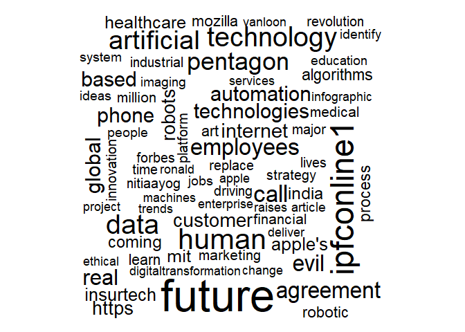 Adding proper nouns to a third custom stop word list and tokenizing.

``` r
custom3_stop_words <- bind_rows(data_frame(word = c("artificialintelligence", "ai", "rt", "gt", "amp", "machinelearning","deeplearning","bigdata", "datascience", "apple", "microsoft", "ibm", "amazon", "ipfconline1", "quindazzi", "mckinsey", "mit", "iainljbrown", "nitiaayog", "vanloon", "google","ronald", "apple's", "forbes", "blockchain", "mozilla", "deeplearn007", "thomas1774paine", "3", "000", "1", "5", "10", "12", "2018", "2", "tech", "ml", "dl", "pentagon", "digitaltransformation", "mgi", "weftrends", "india", "europe","iot", "software", "cybersecurity", "hr", "fintech", "deepaerodrones", "mikequindazzi", "thenextweb", "valaafshar"),
lexicon = c("custom")), stop_words)
```

``` r
tidyAItwts <- AItwtdata %>%
  select(text) %>%
  mutate(line = row_number()) %>%
  unnest_tokens(word, text) %>%
  anti_join(custom3_stop_words)
```

    ## Joining, by = "word"

The final word cloud displays the words for conducting sentiment analysis. There will be some words that will go unmatched in the three reference lexicons' word lists and other neutral words.

``` r
tidyAItwts %>%
   anti_join(custom3_stop_words) %>%
   count(word) %>%
   with(wordcloud(word, n, max.words = 100))
```

    ## Joining, by = "word"

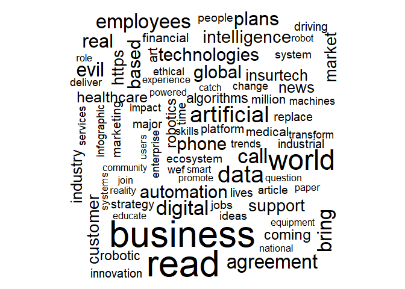

Sentiment Analysis
==================

`Tidyverse`contains reference lexicons for conducting sentiment analysis. The word-wise sentiment analyses to be performed on the AI tweet data are:

-   on the corpus, composed of sentiment words in all tweet texts (tweets) for the 7 days preceding the data extraction (NOTE: this has changed since my original proposal because the Twitter data policy has changed, not allowing the selection of data specific extractions);
-   characterizing users' tweets as postive or negative with data grouped by user; and
-   using bigrams for context, especially for negating sentiments.

There are three lexicons in the `tidyverse` package, two binary lexicons - `Bing` and `NRC`, and one that is an ordinal range from -5 to 5, `AFINN`. I am not going to compare and contrast among the lexicons. Instead, I will utilize the specific lexicon which I think works best for the aspect of analysis while making use of all three.

Sentiments of single words in corpus of tweets
----------------------------------------------

### Analysis with the Bing lexicon

Looking at net sentiment of corpus by word sentiment with `bing` and `ggplot2.` The `Bing` lexicon reference list provides for *positive* and *negative* sentiments.

``` r
bing_nets <- tidyAItwts %>%
  inner_join(get_sentiments("bing")) %>%
  count(line, sentiment) %>%
  spread(sentiment, n, fill = 0) %>%
  mutate(sentiment = positive - negative)
```

    ## Joining, by = "word"

``` r
ggplot(bing_nets, aes(line, sentiment)) +
  geom_col(show.legend = FALSE)
```

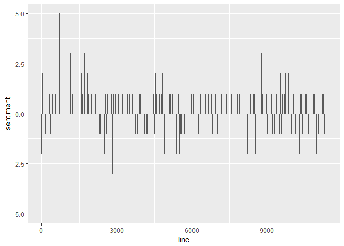

From counts of individual words in the total pool, the top 10 most-used *positive* and *negative* words, respectively.

``` r
bing_counts <- tidyAItwts %>%
  inner_join(get_sentiments("bing")) %>%
  count(word, sentiment)
```

    ## Joining, by = "word"

``` r
bing_tops <- bing_counts %>%
  group_by(sentiment) %>%
  top_n(10) %>%
  ungroup() %>%
  mutate(word = reorder(word, n))
```

    ## Selecting by n

Using `ggplot2` to create bar charts to identify the words and their relative frequency.

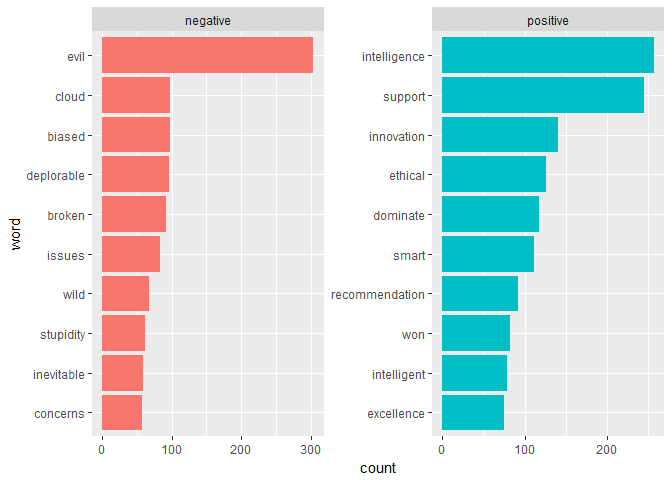

### Using the `NRC` lexicon

The `NRC` lexicon has ten sentiments, the *positive* and the *negative*, like are included in `Bing`, and more specific descriptors: *anger*; *anticipation*; *disgust*; *fear*; *joy*; *sadness*; *surprise*; and *trust*.

The *negative* and *positive* word counts in the total pool of tweets using `NRC`.

``` r
nrc_counts <- tidyAItwts %>%
  inner_join(get_sentiments("nrc")) %>%
  count(word, sentiment)
```

    ## Joining, by = "word"

The top words expressing the general sentiments.

``` r
nrc_pn_tops <- nrc_counts %>%
  group_by(sentiment) %>%
  filter(sentiment %in% c("positive", "negative")) %>%
  top_n(10) %>%
  ungroup() %>%
  mutate(word = reorder(word, n))
```

    ## Selecting by n

``` r
ggplot(nrc_pn_tops, aes(x = word, y = n, fill = sentiment)) +
    geom_col(show.legend = FALSE) +
    facet_wrap(~sentiment, scales = "free") +  
    coord_flip() +
ylab("count")
```

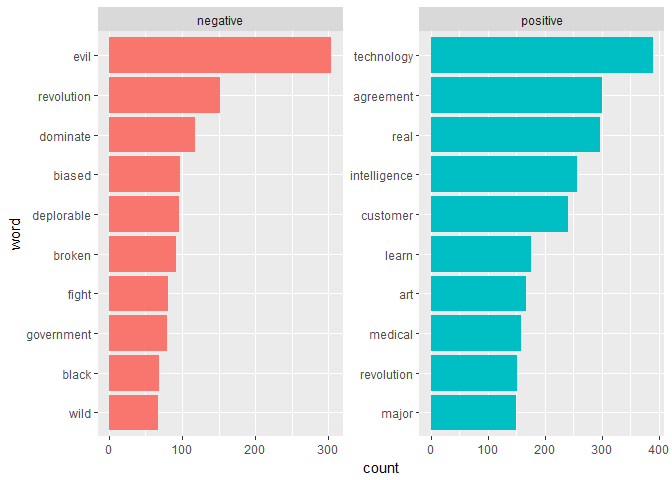

Exploring tweet words associated with the specific sentiments included in the `NRC` lexicon.

``` r
nrc_specific_tops <- nrc_counts %>%
  group_by(sentiment) %>% 
  filter(sentiment %in% c("anger", "anticipation", "disgust", "fear", "joy", "sadness", "surprise", "trust")) %>%
  top_n(10) %>%
  ungroup() %>%
  mutate(word = reorder(word, n))
```

    ## Selecting by n

Visualizing comparisons of top word frequencies within specific sentiment categories of the `NRC`.

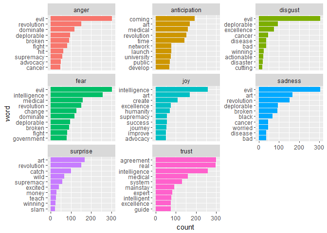

The specific sentiments *trust* and *fear* occur the most frequntly, which is an interesting result because the former is very positive and the latter very negative.

``` r
nrc_twotop_tops <- nrc_counts %>%
  group_by(sentiment) %>% 
  filter(sentiment %in% c("fear", "trust")) %>%
  top_n(10)
```

    ## Selecting by n

``` r
head(nrc_twotop_tops)
```

    ## # A tibble: 6 x 3
    ## # Groups:   sentiment [2]
    ##   word       sentiment     n
    ##   <chr>      <chr>     <int>
    ## 1 agreement  trust       300
    ## 2 broken     fear         92
    ## 3 change     fear        127
    ## 4 deplorable fear         96
    ## 5 dominate   fear        118
    ## 6 evil       fear        304

### *Trust* words in the pool of tweets

Words associated with *trust* in the `NRC` lexicon.

``` r
nrc_trust <- get_sentiments("nrc") %>%
 filter(sentiment == "trust")

trust_words <- tidyAItwts %>%
  inner_join(nrc_trust) %>%
  count(word, sort = TRUE)
```

    ## Joining, by = "word"

``` r
trust_words %>%
  top_n(20) %>%
  mutate(word = reorder(word, n)) %>%
  ggplot(aes(x = word, y = n)) +
  geom_col() +
  coord_flip()
```

    ## Selecting by n

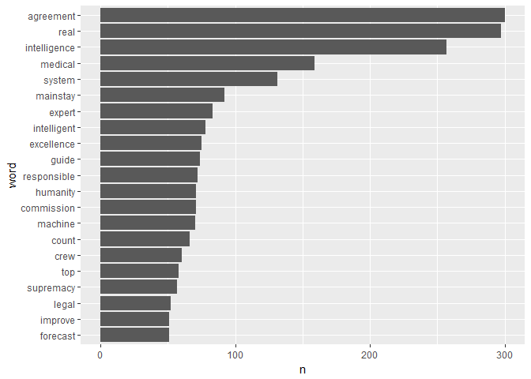

Visualizing pair-wise comparisons for the ten most frequent words determined by the `nrc` lexicon to be sentiments of *trust* and *fear*, respectively.

``` r
nrc_twotop_tops <- nrc_twotop_tops %>% group_by(sentiment) %>% arrange(sentiment, desc(n))
nrc_twotop_tops %>% 
  group_by(sentiment) %>% 
  mutate(index=1:n()) %>% 
  ggplot(aes(x=factor(index), y=n, fill=sentiment)) +
    geom_col(position = position_dodge(width = 0.9)) +
    geom_text(aes(y=0,label=word), hjust=0,
              position = position_dodge(width = 0.9))+
      coord_flip() +
  ylab("Word occurrences") +
  xlab("Ten trust and fear words")
```

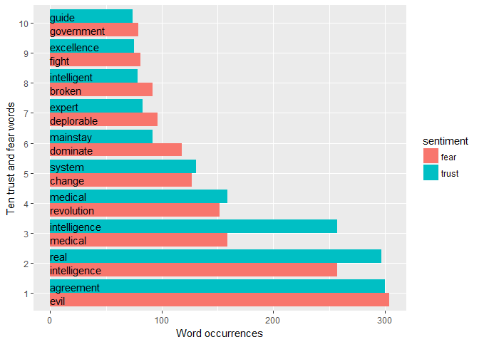

The word "intelligence" appears and is in the top three word frequencies of both *trust* and *fear*. This occurrence has a neutralizing effect on the numbers but cannot be interpreted as cancelling each other out in actual meaning of the tweets. Likewise, "medical" occurs in the top word counts of both. This ambiguity, lack of context, is one of the limitations of sentiment analysis by word. Differentiation between them requires further exploration.

The `NRC` matched unambiguous word, "evil," has the most frequent occurrences, which runs counter to the overall positivity to the corpus.

Characterizing tweeters' sentiments by words
--------------------------------------------

Separating by author (associated with the identifier `user_id`) the total pool of words included in tweet texts may provide a more meaningful sentiment analysis to single word analysis in the corpus. Although, the approach provided by `Bing` and `NRC` would allow net sentiments as the aggregation of words by user, the `AFINN` lexicon provides more information about the individual words used.

### Using the `AFINN` lexicon

`AFINN` scores words from a negative sentiment to positive sentiment in a range of scoring -5 to 5. Through aggregating the word score, the net sentiment of the user (i.e., the total score by user) can be positive or negative. This measure of sentiment is subject to how many words are common to `AFINN` and the tweets, the relative degree of the word score, and the length and quantity of the tweets of a particular user.

Assigning words to a particular user.

``` r
tidyIDtwts <- AItwtdata %>%
select(text, user_id) %>%
unnest_tokens(word, text) %>%
anti_join(custom3_stop_words)
```

    ## Joining, by = "word"

``` r
head(tidyIDtwts)
```

    ## # A tibble: 6 x 2
    ##   user_id   word          
    ##   <chr>     <chr>         
    ## 1 157981564 supercomputing
    ## 2 157981564 skills        
    ## 3 157981564 digital       
    ## 4 157981564 programme     
    ## 5 157981564 shape         
    ## 6 157981564 europe's

Utilizing the `AFINN` sentiment scoring and aggegating the scores by user.

``` r
bytwt_afinn <- tidyIDtwts %>%
group_by(user_id) %>%
inner_join(get_sentiments("afinn")) 
```

    ## Joining, by = "word"

``` r
byID_sentimentscore <- bytwt_afinn %>%
group_by(user_id) %>%
  mutate(totalID_score = sum(score)) %>% 
  select(user_id, totalID_score) %>% 
  unique()
  
head(byID_sentimentscore)
```

    ## # A tibble: 6 x 2
    ## # Groups:   user_id [6]
    ##   user_id            totalID_score
    ##   <chr>                      <int>
    ## 1 157981564                      4
    ## 2 16311530                      -1
    ## 3 416857073                     14
    ## 4 907905634770804736             6
    ## 5 48030925                       4
    ## 6 29753422                       2

Visiualizing users' net sentiment scores.

``` r
ggplot(byID_sentimentscore, aes(x = user_id, y = totalID_score)) +
  geom_point(size = 4, alpha = 0.3) +
  scale_y_continuous(breaks = seq(-45, 45, by = 5)) +
xlab("User IDs") +
ylab("Users' total score")
```

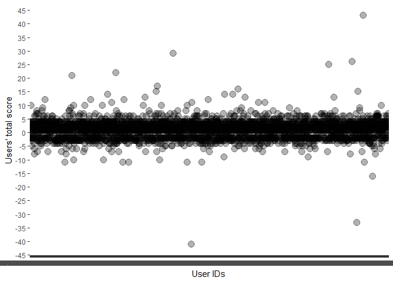

The scatterplots reveals a tight clustering of total `AFINN` word scores which may result from the restricted character length of tweets. The histogram below provides more clarity, displaying a bimodal distribution with the frequency of positive total sentiment scored users exceeding the users with negative scores.

Medians for distributions of users with net positive or net negative scores

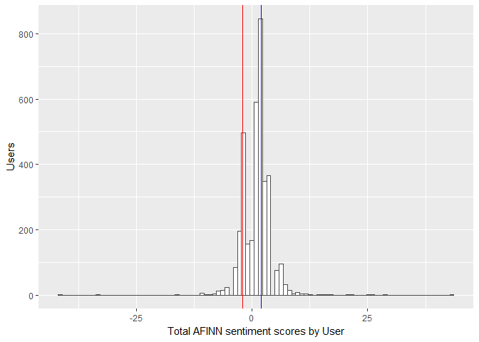

### Average scores by user ID

Because tweets can be composed of more slightly positive or slightly negative words and there can be numerous tweets by a particular user (which may result in more scored words), the aggregated scores could mask words with a high degree of positivity or negativity (i.e. 4 and 5). Average sentiment scores for the users may be more indicative of sentiment.

``` r
afinnwords_byID <- bytwt_afinn %>% group_by(user_id) %>%
  summarize(Count=n(), AvgScore=round(sum(score)/Count,2))

ggplot(afinnwords_byID, aes(AvgScore))+geom_density() +
xlab("Mean AFINN sentiment scores by user")
```

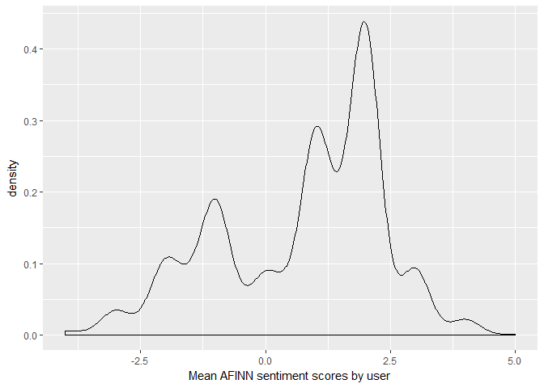

The plot above reveals that most of the words of any given user are not extremely positive or negative given `AFINN` scoring. However, again, shown more clearly in this graph, the average sentiment of the Tweeters are far more positive than negative which supports the results found in the total pool of tweets.

Bigrams
-------

Word pairs occurring most frequently in the corpus
==================================================

``` r
twtAIbigrams<- AItwtdata %>%
select(text) %>%
mutate(line = row_number()) %>%
unnest_tokens(bigram, text, token = "ngrams", n = 2)

twtAIbigrams %>% 
  count(bigram, sort = TRUE)
```

    ## # A tibble: 44,760 x 2
    ##    bigram                         n
    ##    <chr>                      <int>
    ##  1 artificialintelligence and   840
    ##  2 of the                       629
    ##  3 of artificialintelligence    593
    ##  4 artificialintelligence to    587
    ##  5 in the                       554
    ##  6 artificialintelligence in    544
    ##  7 the future                   506
    ##  8 and artificialintelligence   468
    ##  9 how artificialintelligence   453
    ## 10 read more                    451
    ## # ... with 44,750 more rows

Separating the bigrams allows the filtering of stop words from word1 and/or word2, and provides the opportunity to filter for specific words. Using the prior custom stop word list developed for single words provides more meaningful bigrams.

``` r
AIbigram_sep <- twtAIbigrams %>% 
  separate(bigram, c("word1", "word2"), sep = " ")

AIbigram_filter0 <- AIbigram_sep %>% 
  filter(!word1 %in% stop_words$word) %>% 
  filter(!word2 %in% stop_words$word)

AIbigram_filter0 %>% 
  count(word1, word2, sort = TRUE)
```

    ## # A tibble: 18,726 x 3
    ##    word1                  word2                      n
    ##    <chr>                  <chr>                  <int>
    ##  1 rt                     ipfconline1              442
    ##  2 artificialintelligence ai                       401
    ##  3 ai                     machinelearning          384
    ##  4 gt                     gt                       341
    ##  5 rt                     iainljbrown              332
    ##  6 artificialintelligence program                  304
    ##  7 3                      000                      297
    ##  8 call                   artificialintelligence   297
    ##  9 000                    employees                296
    ## 10 employees              call                     296
    ## # ... with 18,716 more rows

``` r
AIbigram_filter1 <- AIbigram_sep %>% 
  filter(!word1 %in% custom3_stop_words$word) %>% 
  filter(!word2 %in% custom3_stop_words$word)

AIbigram_filter1 %>% 
  count(word1, word2, sort = TRUE)
```

    ## # A tibble: 12,683 x 3
    ##    word1      word2          n
    ##    <chr>      <chr>      <int>
    ##  1 employees  call         296
    ##  2 program    evil         296
    ##  3 business   support      167
    ##  4 process    automation   161
    ##  5 robotic    process      159
    ##  6 industrial revolution   131
    ##  7 medical    imaging      122
    ##  8 deliver    real         114
    ##  9 gal        deplorable    96
    ## 10 internet   users         94
    ## # ... with 12,673 more rows

Uniting the top bigrams allows visualization.

``` r
AIbigram_unite1 <- AIbigram_filter1 %>% 
  unite(bigram, word1, word2, sep = " ")

AIbg20 <- AIbigram_unite1 %>%
  count(bigram, sort = TRUE) %>% 
  top_n(20,n)
```

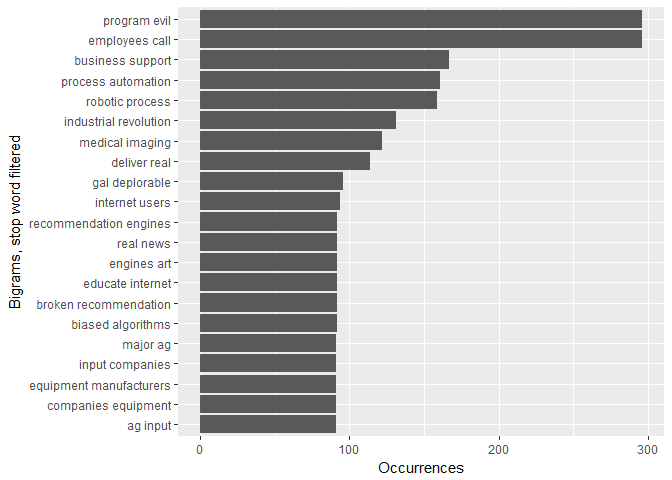

A visual scan of these 20 bigrams reveals a mix of: neutral ("internet users," "recommendation engines," "equipment manufacturers," ...); positve ("deliver real," "educate internet," "medical imaging," ...); and negative phrases ("program evil," "broken recommendation." "biased algorithms," ...). How the two most freqent word pairings, "program evil" and "employees call," are used is essential to interpret sentiments. Even with the presence of the strong term "evil," because of its sequencing in the bigram and its word pairing, it appears not to be used as an adjective.

"Business support," "process automation," and "robotic process" are ambiguously positive or negative from a social perspective but may be construed as positive sentiments given that during the 7-day period in which the tweets were collected, there were no AI news worthy happenings. As a result, my assumption is the tweeters were largely companies and persons for whom AI is of special interest, and not the general public or pundits.

Additonal context of the individual tweet appears to be necessary. Identification and counts provided simplifies the selecting of tweets to further explore their meaning and significance.

Exploring bigrams for contextual sentiment analysis
===================================================

Word pairings often have a preceding negative word which negates the sentiment identified. The most common word for reversing the meaning of the sentiment is "not."

``` r
AIbigram_not <- AIbigram_sep %>% 
  filter(word1 == "not") %>% 
  inner_join(get_sentiments("afinn"), by = c(word2 = "word")) %>% 
  count(word2, score, sort = TRUE) %>% 
  ungroup()

AIbigram_not
```

    ## # A tibble: 13 x 3
    ##    word2      score     n
    ##    <chr>      <int> <int>
    ##  1 like           2    15
    ##  2 alive          1     8
    ##  3 destroying    -3     6
    ##  4 lagging       -2     2
    ##  5 accept         1     1
    ##  6 blind         -1     1
    ##  7 destroy       -3     1
    ##  8 fear          -2     1
    ##  9 good           3     1
    ## 10 hide          -1     1
    ## 11 important      2     1
    ## 12 prepared       1     1
    ## 13 scary         -2     1

There are relatively few "not" bigrams, 13 different ones. The most frequently occurring is the "not like" bigram, which depending on its usage, has various meanings. "Not alive" because the subject is AI is ambiguous in sentiment. "Not destroying" seems an unambiguous negating of a relatively strong term.

Plotting "not" bigrams

``` r
AIbigram_not %>% 
  mutate(contribution = n * score) %>% 
  arrange(desc(abs(contribution))) %>%
  head(20) %>% 
  mutate(word2 = reorder(word2, contribution)) %>%
  ggplot(aes(word2, n * score, fill = n * score > 0)) +
  geom_col(show.legend = FALSE) +
  xlab("Words preceded by \"not\"") +
  ylab("Sentiment score times number of occurences") +
  coord_flip()
```

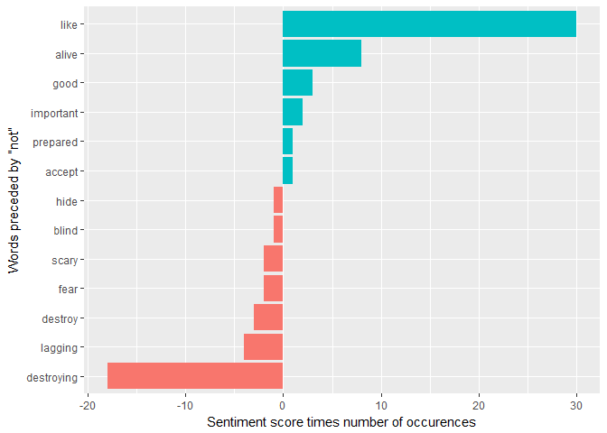

Overall, the "not" phrases add little to the tweet sentiment analysis because they are too few and the largest proportion of the occurrences are ambiguously positive or negative. If the the top two ambiguous words "like" and "alive" were omitted, then the most sentiment words of the "not" bigrams are negative. The negative sentiment scores, supplied by `AFINN` and then reversed in meaning by "not" become positive, which supports the prior positive sentiment results by word on the pool of tweets.

Exploring the corpus for additional negating words, such as "no," "never," and "without.""

``` r
negation_words <- c("not", "no", "never", "without")

AIbigram_neg <- AIbigram_sep %>% 
  filter(word1 %in% negation_words) %>% 
  inner_join(get_sentiments("afinn"), by = c(word2 = "word")) %>% 
count(word1, word2, score, sort = TRUE) %>% 
  ungroup()

AIbigram_neg
```

    ## # A tibble: 21 x 4
    ##    word1   word2      score     n
    ##    <chr>   <chr>      <int> <int>
    ##  1 not     like           2    15
    ##  2 without harming       -2    10
    ##  3 not     alive          1     8
    ##  4 not     destroying    -3     6
    ##  5 no      good           3     4
    ##  6 no      threat        -2     4
    ##  7 no      hiding        -1     2
    ##  8 not     lagging       -2     2
    ##  9 no      bad           -3     1
    ## 10 no      joke           2     1
    ## # ... with 11 more rows

There are relatively few negating words in the tweet data explored.

``` r
AIbigram_neg %>% 
  mutate(contribution = n * score) %>% 
  arrange(desc(abs(contribution))) %>%
  head(20) %>% 
  mutate(word2 = reorder(word2, contribution)) %>%
  ggplot(aes(word2, n * score, fill = n * score > 0)) +
  geom_col(show.legend = FALSE) +
  xlab("Words preceded by negatives") +
  ylab("Sentiment score times number of occurences") +
  coord_flip()
```

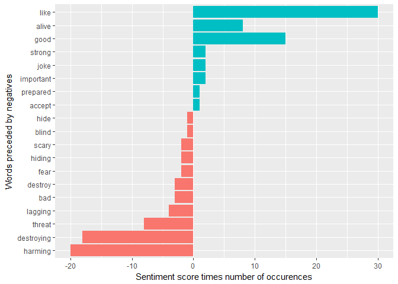 \#\# Conclusion

For the Tweets in a random 7-day period in June 2018, the sentiment expressed about artificial intelligence was much more positive than negative, using all three lexicons. Using the `NRC` lexicon for single word analysis on the total pool of words, the two most frequently occurring specific sentiments were *trust* and *fear*, with the former more frequent. Using `AFINN` word sentiment scoring, calculating both a total and an average score for a specific author (user), the results revealed substantially more positivity than negativity in a bimodal distribution. There were not many users who wrote neutral tweets. The analysis of bigrams, both in stop-word controlled word pairs and negating first words (reversing the sentiment) pairs, reflected a positive sentiment although further usage information would be beneficial to the clarity.

### More Exploration

These results would probably vary if they were more representative of the general public with active Twitter accounts. I assume this 7-day snapshot of tweets are by users who routinely tweet about AI - which implies some technical knowledge. There are marketing tweets, which tend to be associated with positive sentiment language that could be filtered out by the name (associated with a user ID). In fact, the final custom stop word list included proper nouns such as technology companies and consultants.

The same analysis could be used for data extractions for a series of snapshots, especially selected for an AI news event that anchors the beginning of the 7-day period (for free Twitter data). Also, with multiple snapshots taken at intervals of time, or when newsworthy events occur, changes over time could be identified. Term frequencies and term frequency-inverse document frequency (tf-idf) statistics could then be utlitized if the snapshot data extraction were treated as an individual document. This time-series analysis could reveal interesting trends and capture more general Tweeters' sentiments about AI. Similarly, my assumption is that the 280-character limit does not lend itself to topic modeling further than related to AI. If there were more data, the snapshot time period was longer or using data from several snapshots, that would support more granularity about topics and their respective sentiments.
